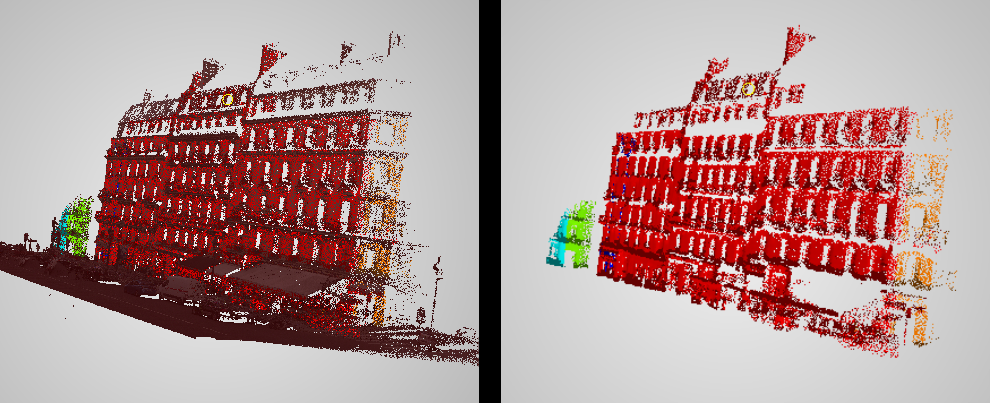
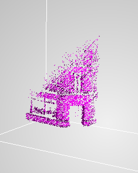
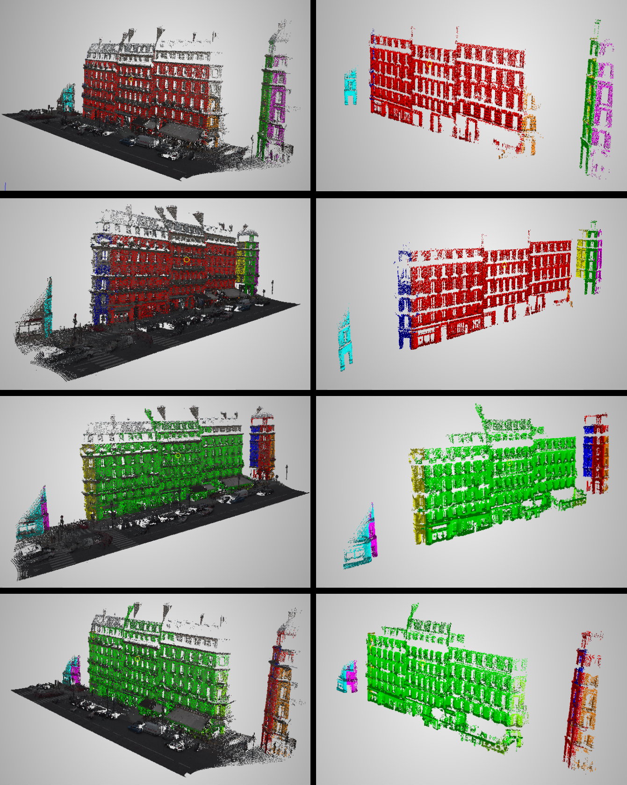

# Wall Segmentation — FRAMES Plugin

A plugin for FRAMES that segments building walls in raw 3D LiDAR point clouds. Coursework project for **OSAD3D** (Optical Scanning and Analysing 3D data techniques), Warsaw University of Technology.



## Problem

A raw 3D point cloud contains not only building walls but also the road, cars, streetlights, traffic signs, and other small infrastructure elements. The algorithm's task is to correctly extract and separate walls from the rest of the environment — with no hardcoded, data-specific values.

The main difficulty is that real-world walls are never perfect mathematical planes: window openings and shopfronts create gaps, while balconies and cornices stick out. Too wide a wall-thickness threshold "swallows" smaller, angled walls into large facades; too narrow a threshold breaks a single wall into several randomly tilted fragments.

Another difficulty was the density of the points, increasing with the distance from the scanner. Because of that, walls that are further from the scanner can have less points than smaller walls that are closer to it.

## Pipeline

```
[Raw point cloud]
      │
      ▼
[Preprocessing] ──► Undersampling → Isolated-point filter → Normal-vector filter
      │
      ▼
[Scale loop (coarse-to-fine, adjustable iteration count)]
   ├─► Scale 1 (r=8m,  threshold 6400 inliers) → large facades
   ├─► Scale 2 (r=4m,  threshold 3200 inliers) → medium walls
   └─► Scale 3 (r=2m,  threshold 1600 inliers) → smaller walls / sparser fragments
      │
      ▼
[Spatial BFS — detail phase] ──► absorbs balconies/cornices, rejects poles and cars as noise
```

1. **Undersampling** — randomly reduces point cloud density (50% by default) to cut down computational cost.
2. **Isolated-point filter** — discards points that don't have enough neighbours within a given radius (measurement noise).
3. **Normal-vector filter** — computes a local normal for each point's neighbourhood and rejects horizontal surfaces (ground, roofs).
4. **Multi-scale RANSAC** — fits planes starting from the largest search radius and highest inlier threshold, then works down (exponentially) through progressively smaller scales. Each plane found is immediately expanded with a local BFS (region growing) bounded by the plane's thickness.
5. **Wall-dimension filter** — discards planes smaller than a given minimum width/height (2m × 8m by default), which eliminates cars, barriers, and poles (often denser point-wise, being closer to the scanner).
6. **Detail BFS (optional)** — a final, longer-range BFS pass that attaches outlying architectural detail points (balconies, cornices) to already-accepted walls.

## Approach evolution

A quick summary of what didn't work along the way:

- **v1 — plain BFS with a visited flag**: neighbouring walls "stole" points from each other at corners before either had a chance to fully segment.
- **v2 — stability filter** (% of inliers in a point's local neighborhood): sound in theory, but window openings and small surface irregularities broke large facades into a few smaller, randomly tilted planes.
- **v3 — final solution**: dropped the stability filter in favor of non-linear (exponential) threshold scaling across RANSAC scales, plus a minimum wall-dimension filter. This turned out to be the most reliable approach — removing large structures first cleans up the cloud and lets a smaller radius precisely segment details without the risk of being "swallowed" by dominant facades.

## Known limitations

- Whichever wall's BFS runs first can "steal" nearby points from a neighboring wall before that wall gets its own turn (possible fix: run BFS in a loop, one iteration per wall, instead of a single unbounded iteration).
- The largest wall is sometimes split into two separate segments, and angled walls with lower point density (facing away from the street) can end up merged with a neighboring wall.

  

- Default parameter values were tuned for the specific test cloud and may need adjusting for other datasets.

## Results gallery



## Parameters

All parameters are editable from the FRAMES GUI (no hardcoded values):

| Parameter (Bank name) | Variable | Default | Description |
|---|---|---|---|
| `NodeId` | `NodeId` | — | Input point cloud node |
| `removePercent` | `RemovePercent` | 50 | % of points removed during undersampling |
| `IsolatedRadius` | `IsolatedRadius` | 0.8 | Neighbor-search radius for the isolated-point filter |
| `MinNeighbour` | `MinNeighbours` | 20 | Minimum neighbor count for a point to not be treated as noise |
| `NormalFilterRadius` | `NormalRadius` | 0.2 | Radius used to compute the local normal |
| `NormalTresholdPoints` | `NormalThresholdPoints` | 0.2 | Z-normal threshold used to reject horizontal surfaces |
| `PlaneRadius` | `PlaneBaseRadius` | 10.0 | Base neighbor-search radius for RANSAC (scaled per loop iteration) |
| `RANSACIterations` | `RansacIterations` | 300 | Failed RANSAC attempts allowed before moving to the next scale |
| `PlaneThickness` | `PlaneThickness` | 0.25 | Plane thickness (RANSAC + BFS) |
| `NormalTresholdWall` | `NormalThresholdWall` | 0.05 | Max. deviation of a plane's normal from vertical to count as a wall |
| `BFSRadius` | `BfsRadius` | 0.8 | Region-growing BFS radius when confirming a wall |
| `minInliersCount` | `MinInliersCount` | 6400 | Base inlier threshold (scaled down across scales) |
| `ScalesCount` | `ScalesCount` | 3 | Number of scale layers in the multi-scale RANSAC loop |
| `MinWallWidth` | `MinWallWidth` | 2.0 | Minimum width for a plane to count as a wall |
| `MinWallHeight` | `MinWallHeight` | 8.0 | Minimum height for a plane to count as a wall |
| `addBFS_Enable` | `RunDetailBfs` | true | Enables the final detail-absorption BFS pass |
| `addBFS_Radius` | `DetailBfsRadius` | 0.6 | Radius for the final BFS pass |

## Requirements

- Visual Studio 2022
- Qt 5.14+ (`msvc2019_64` and `QtCharts` modules; `QTDIR` environment variable set to the Qt install directory)
- [Qt Visual Studio Tools](https://marketplace.visualstudio.com/items?itemName=TheQtCompany.QtVisualStudioTools2022) (VS extension)
- [FRAMES](http://ztrw.mchtr.pw.edu.pl) — a plugin-based framework for 3D point cloud visualization and analysis

## Installation & usage

1. Install Visual Studio 2022 and Qt (5.14 or later) with the `msvc2019_64` and `QtCharts` modules; set the `QTDIR` environment variable.
2. Install the Qt Visual Studio Tools extension.
3. Download and build FRAMES — open `Example.sln`, let VS update the project (platform v143), build in 64-bit.
4. Clone this repo into FRAMES' `plugins/` directory.
5. Build the plugin in your chosen configuration (Release recommended for large clouds — Debug only for debugging).
6. Launch the FRAMES GUI, load a point cloud as a project, and run the `Find vertical surfaces` plugin from the interface.
7. Rebuild the plugin after every code change before rerunning it in the GUI.

## Repo structure

```
.
├── WallSegmentation.cpp   # plugin implementation
├── images/                # figures from the report (before/after, results gallery)
└── README.md
```

## Author

Antoni Biskupski — Warsaw University of Technology, Automation, Robotics and Industrial Computer Science
